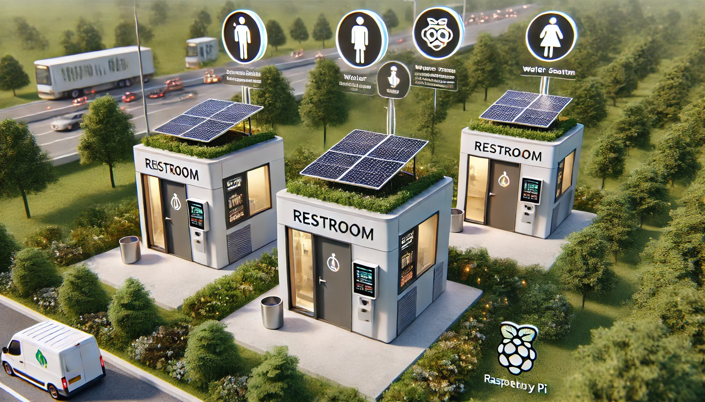

# "Πρόταση έργου για Δημιουργία Αυτόνομου Δίκτυου Τουαλετών"

Παρακάτω περιγράφεται η πρόταση έργου για την συμμετοχή της ομάδας μας , "Hercules_Toilet", στον «7ο Πανελλήνιο Διαγωνισμό Ανοιχτών Τεχνολογιών στην Εκπαίδευση»

**Ομάδα:  "Hercules_Toilet"** Μαθητές από ΕΠΑΛ ΘΗΒΑΣ 

**Τίτλος έργου:** «Αυτόνομο Δίκτυο Τουαλετών »

___

<!--

-->

___

# Ι .  Περιγραφή της ιδέας 

Στο έργο αυτό προτείνουμε την κατασκευή ενός δικτύου από ενεργειακά αυτόνομα κτίρια Τουαλετών και αντίστοιχο κεντρικό σύστημα διαχείρισης.

---

>  * Οι  εικόνες έχουν παραχθεί με  τεχνητή νοημοσύνη.  Η απεικόνιση   είναι γενική και προσεγγιστική  και όχι με ιδιαίτερες λεπτομέρειες .  Αποσκοπεί στη αναπαράσταση  της  κεντρική ιδέα της πρότασης(δίνεται έμφαση στο αποτέλεσμα και την περιγραφή του).   Προφανώς τεχνικά δεν είναι ακριβής και δεν αποτελούν την απεικόνιση της τελικής κατασκευής *
---

Νομίζουμε πως είναι κοινή παρατήρηση και παραδοχή , το παράδοξο πως ένας από τους πιο χρήσιμους χώρους , ο χώρος της τουαλέτας , είναι αρκετά δυσεύρετος , υποτιμημένος και παραμελημένος . Τόσο στις εθνικές οδούς όσο και σε αστικούς και ημι-αστικούς χώρους, οι προηγούμενες παρατηρήσεις, είναι κάτι παραπάνω από φανερές.

Πέραν του αποσπασματικού και ημιτελούς αστικούς σχεδιασμού , προσπαθήσαμε αναλύοντας να βρούμε τους λόγους που οδηγούν στην κατάσταση αυτή. Θα μπορούσαν να καταγραφούν πολλοί λόγοι, αλλά θα περιοριστούμε σε αυτούς που  κατά την άποψή μας είναι οι σημαντικότεροι και που αποτέλεσαν αφορμή για τη συγκεκριμένη πρόταση έργου. 

Πιο συγκεκριμένα , παραθέτουμε παρακάτω τους σημαντικότερους λόγους και αιτίες :

**1) Δυσκολία πρόσβασης στα κεντρικά δίκτυα** : πολλές φορές το κόστος δημιουργίας μίας τουαλέτας είναι πολύ μικρότερο από αυτό που απαιτείται για να μπορεί να συνδεθεί με τα κεντρικά δίκτυα (όπως νερού,ηλεκτρικού ρεύματος , κ.τ.λ)

**2) Δυσκολία διαχείρισης- συντήρησης** : ακόμα και αν το παραπάνω κόστος δεν είναι απαγορευτικό , το επόμενο εμπόδιο και ίσως μεγαλύτερο είναι το κόστος λειτουργίας και συντήρησης.

Τα παραπάνω συμπεράσματα αποτέλεσαν και την αφετηρία  για την σκέψη μας και τελικά  για την δόμηση της πρότασής μας .Πιο συγκεκριμένο οι προτάσεις μας κινούνται σε δύο άξονες : πρώτον της τοπικής αυτονομίας και δεύτερον της κεντρικής διαχείρισης.

- **Τοπική Αυτονομία** : 

    - Μέσω  τοπικού και αυτόνομου φωτοβολταϊκού εξασφαλίζεται η ενεργειακή αυτονομία και επάρκεια , και ταυτόχρονα δεν χρειάζεται η προσέγγιση με το κεντρικό δίκτυο ηλεκτρικού ρεύματος 
    - Με κατάλληλους αυτοματισμούς  μειώνονται οι καταναλώσεις  τόσο νερού όσο και ενέργειας 
    - Με τοπική διαχείριση του νερού και την μείωση των καταναλώσεων , προσπαθούμε να επιτύχουμε την αυτονομία και την μικρότερο δυνατή εξάρτηση από το δίκτυο νερού.

-  **Κεντρική Διαχείριση** : 

    - Μέσω της κεντρικής διαχείρισης δεν είναι απαραίτητη η συνεχής ανθρώπινη παρουσία  και μπορεί να επιτευχθεί η  επιθυμητή μείωση του κόστους και της εξάρτησης 
    - Με την κεντρική συλλογή δεδομένων και πληροφοριών , μπορούμε τόσο να καταλάβουμε και να καταγράψουμε τις ανάγκες και να ρυθμίσουμε κατάλληλα το σύστημα
    - με τον απομακρυσμένο έλεγχο μπορούμε να καταστήσουμε το σύστημα βιώσιμο και να έχουμε τις κατάλληλες και έγκαιρες παρεμβάσεις 

<!---->

Το σύστημά μας θα υλοποιηθεί  με  ανοιχτό και ελεύθερο λογισμικό και υλικό , το οποίο θα μπορούμε να διαχειριστούμε τοπικά καθώς και από το διαδίκτυο. Επίσης το σύστημά μας δεν θα είναι δεσμευμένο και εξαρτώμενο από εξωτερικές υπηρεσίες και τέλος  θα είναι  πλήρως επεκτάσιμο.

---

# Τι παρόμοιο υπάρχει - Τρέχουσα αντιμετώπιση προβλήματος

Στην προσπάθειά μας να ερευνήσουμε την τρέχουσα κατάσταση και να παρατηρήσουμε τι λύσεις υπάρχουν σε παρόμοια προβλήματα καταλήξαμε στις παρακάτω διαπιστώσεις:

-  **Υπάρχουσες προτάσεις Τοπικής Αυτονομίας** : 

    - Υπάρχουν λίγες και **περιορισμένες**  λύσεις αυτονομίας. 
    - Περισσότερο οι λύσεις αυτές περιορίζονται στην **χημική διαχείριση των αποβλήτων**
    - Σπάνια έως ποτέ δεν πετυχαίνουν ή **δεν προσδοκούν** να είναι ενεργειακά αυτόνομες
    - Οι αυτοματισμοί είναι πολύ λίγοι, **αποσπασματικοί** και σίγουρα όχι αρκετοί
    - Σίγουρα οι χώροι αυτοί είναι δεν αποπνέουν την αίσθηση μιας μοντέρνας λύσης και ενός όμορφου και οικείου χώρου
    - Δεν προσφέρουν ευκολίες ( όπως φόρτιση κινητού, ανακοινώσεις, infostation , κτλ...)
    - Βασίζονται σε **κλειστές εταιρικές λύσεις** και μάλιστα **ιδιαίτερα ακριβές**.
    - Ο χρήστης τους είναι εγκλωβισμένος στην χρήση μόνο συστημάτων της "Εταιρείας-Λύσης", που θα επιλέξει, χωρίς να μπορεί να  συνδυάσει τα καλά διαφόρων συστημάτων.
    - Επίσης πάντα οι προτεινόμενες λύσεις **δεν μπορούν να προσαρμοστούν** απόλυτα στις ανάγκες   που θα θέλαμε εμείς και ούτε  να μας δώσουν τη δυνατότητα προγραμματισμού εκ μέρους μας.

-  **Υπάρχουσες προτάσεις Κεντρικής Διαχείρισης** : 

    - **ΔΕΝ Υπάρχουν** καθόλου λύσεις για Κεντρική Διαχείριση 
    - **ΔΕΝ Υπάρχει** σύστημα κεντρικής παρακολούθησης και ελέγχου των εγκαταστάσεων
    - **ΔΕΝ Υπάρχει**  σύστημα ειδοποιήσεων και βλαβών που να βοηθάει στην έγκαιρη επέμβαση

Η προτεινόμενη λύση είναι σε διαφορετική κατεύθυνση. Υιοθετώντας ανοιχτές τεχνολογίες έχουμε την πλήρη ελευθερία και πλήρη έλεγχο στον προγραμματισμό και στην ανάπτυξη της πλατφόρμας. 

# Αναγκαιότητα του Έργου - Στόχοι

Σύμφωνα με την ανάλυση των δεδομένων που παρουσιάστηκαν στην προηγούμενη παράγραφο, προέκυψε η ιδέα και η πρόταση για το παρόν σύστημα.

Πιο συγκεκριμένα το σύστημα που προτείνουμε έχει τα παρακάτω χαρακτηριστικά τα οποία προσπαθούν να λύσουν τα προβλήματα που προέκυψαν κατά την έρευνά μας. Τα προτεινόμενα και επιθυμητά χαρακτηριστικά είναι τα εξής:

 - Να είναι ενεργειακά αυτόνομο και αποδοτικό
 - Να βασίζεται στην ανακύκλωση( π.χ νερού ), συμβάλλοντας στην προστασία του περιβάλλοντος.
 - Να προσφέρει μοντέρνες ευκολίες ( π.χ φόρτιση κινητού, ανακοινώσεις, πληροφορίες)
 - Να μπορούν να εντοπίζονται έγκαιρα οι βλάβες
 - Να ακολουθεί ανοικτά πρότυπα
 - Να είναι επεκτάσιμο 
 - Να μπορεί να διασυνδέει υπάρχοντα συστήματα
 - Να δίνει την δυνατότητα προγραμματισμού στον χρήστη
 - Να συντελεί στην δημιουργία προτύπου για πειραματισμό
 - Την δημιουργία πειραματικής υποδομής για μελλοντική χρήση τόσο στο σχολείο όσο και αλλού
 - Να αξιοποιεί τις δεξιότητες όλων των μελών της ομάδας
 - Να αποπνέει μια ζεστή-ευχάριστη αίσθηση και  μοντέρνο σχεδιασμό 
 - Να εξοικειώνει με την εξοικονόμηση ενέργειας και φυσικών πόρων
 - Να προωθεί την δημιουργία καινοτομίας 

 
---

# Ι Ι .  Δομή - Χρήση- Υλοποίηση του συστήματος

---

Το σύστημα περιλαμβάνει τα ακόλουθα μέρη:

# Βασικά μέρη του συστήματος
Τα βασικά μέρη του συστήματος μας περιγράφεται παρακάτω 

<!---->

<!--

-->

## 1. Control Room (Κεντρικός server του συστήματος) 

Κεντρικό ρόλο στο σύστημά μας έχει το Control Room.Εκεί θα βρίσκεται ο εξυπηρετητής (server) που θα εφαρμόζει τη Κεντρική Διαχείριση . Στην πρότασή μας αυτό θα γίνεται μέσω ενός raspberry pi . Εδώ θα εγκατασταθεί  ανοικτό λογισμικό το οποίο θα εκτελεί όλες τις διαδικασίες παρακολούθησης, ελέγχου και καταγραφής.

Πιο συγκεκριμένα θα μπορεί να :
* Επικοινωνεί με όλους τους Toilet Controllers δικτυακά (Τοπικός Ελεγκτής Τουαλέτας) 
* Δημιουργεί το κατάλληλο web interface για τον χρήστη έτσι ώστε να υλοποιεί την δικτυακή απομακρυσμένη διαχείριση
* Απεικονίζει τις τρέχουσες τιμές μεγεθών και αισθητήρων (για κάθε τουαλέτα)
* Μεταδίδει τις αναγκαίες εντολές προς τους ενεργοποιητές (για κάθε τουαλέτα)
* Ενημερώνεται ο χειριστής για δυσλειτουργίες
* Λοιπές λειτουργίες

## 2. Toilet Controller (Τοπικός Ελεγκτής Τουαλέτας) 

Βασική θέση στο σύστημα μας , θα έχει ο Τοπικός Ελεγκτής Τουαλέτας, ο οποίος θα είναι ένας ανά Τουαλέτα. Σκοπός του είναι ο έλεγχος και παρακολούθηση των τοπικών **Sensors-Actuators (βλέπε 4)**  καθώς και  η επικοινωνία με το Control Room ( server).

Αναλυτικότερα η  συσκευή αυτή θα αποτελείται από :

* Μικροελεγκτή τοπικού ελέγχου με wi-fi επικοινωνία
* Πρωτόκολλο Αμφίδρομης επικοινωνίας με  το Control Room 
* Παρακολούθηση των Σημείων ελέγχου (βλέπε 4 - μόνο τοπικά στον χώρο ευθύνης του)
* Κατάλληλο  κουτί εγκατάστασης και τοποθέτησης
* Τροφοδοσία από το Solar Trucker (βλέπε 3)

## 3.Solar Trucker (Αυτόνομο Φωτοβολταϊκό με παρακολούθηση ηλίου)

Στο επίκεντρο της τοπικής ενεργειακής αυτονομίας βρίσκεται ένα αυτόνομο φωτοβολταϊκό σύστημα του οποίου τα πάνελ θα είναι προσαρμοσμένα στον solar tracker που θα κατασκευάσουμε

Ειδικότερα θα μπορεί να :

* Παρακολουθεί τον ήλιο για μέγιστη απόδοση
* Μετακινείται σε δύο άξονες
* Παρέχει τροφοδοσία στο σύστημα  του Toilet Controller (βλέπε 2)
* Φορτίζει τις μπαταρίες
* Θα δίνει τη δυνατότητα στο χώρο να παρέχει φορτιστή για τις κινητές συσκευές του χρήστη της τουαλέτας
* Καταγράφει την τάση και την ενέργεια που παρέχει στην έξοδο του

## 4.Sensors-Actuators (Ελεγχόμενες Συσκευές-Αισθητήρες) 

Το σενάριο λειτουργίας κάθε χώρου θα υλοποιείται απο τις ελεγχόμενες συσκευές. Στις συσκευές αυτές θα μπορούν να συμπεριληφθούν  εμπορικές συσκευές καθώς και δικές μας ιδιοκατασκευές.
 
 Αναλυτικότερα θα μπορούν να είναι :
 
* Για παρακολούθηση και εξοικονόμηση φυσικών πόρων
    * Μετρητές κατανάλωσης ενέργειας
    * Μετρητές χρήσης και αποθέματος νερού
* Για παρακολούθηση και βελτίωση περιβαλλοντικών συνθηκών της τουαλέτας
    * Αισθητήρες θερμοκρασίας αέρα 
    * Αισθητήρες υγρασίας αέρα
* Ενεργοποιητές για εκτέλεση ενεργειών
    * Αντλίες άντλησης, εκτόξευσης νερού 
    * Πρίζες ελεγχόμενες ελεγχόμενες από  wi-fi
    * Φωτιστικά ή λεντοταινίες (για φωτισμό χώρου)
* Για σήμανση , ενημέρωση και ειδοποίηση των επισκεπτών 
    * Συσκευές Σήμανσης (π.χ Σειρήνα ή Φωτεινή πηγή)
    * Ανακοινώσεων (π.χ Ηχεία, μικρή οθόνη)
    * Πρίζες ελεγχόμενες ελεγχόμενες από  wi-fi

>  * Σημείωση : Στο έργο δεν θα συμπεριλάβουμε όλες τις παραπάνω Ελεγχόμενες Συσκευές, αλλά μόνο θα προδιαγράψουμε τον τρόπο ελέγχου και επικοινωνίας *

---

# Κύρια Χαρακτηριστικά

---
 - Στο Υλικό   και στο Λογισμικό θα γίνεται χρήση αποκλειστικά **ανοιχτών τεχνολογιών  και ανοιχτού λογισμικού** (Raspberry Pi, Node Red , Python,  ESP32, Arduino, c++, MQTT ,  κτλ)

 - Στο Control Room (Κεντρικός server του συστήματος) Ο κεντρικός σταθμός θα αποθηκεύει  **" τα σενάρια των αυτοματισμού"**  τα οποία θα δρομολογούνται προς τους Toilet Controllers (Τοπ. Ελεγκ. Τουαλέτας) κατά τη κρίση του διαχειριστή

 - Η αυτοματοποίηση  θα μπορεί  να επεκταθεί σε μεγαλύτερο αριθμό **κτιρίων** 
 
  
 - Συνολικά ο σχεδιασμός θα παρέχει την μέγιστη δυνατή **επεκτασιμότητα**  και θα ακολουθεί λογική **αρθρωτού  σχεδιασμoύ**.

---

# Υλικά - Λίστα υλικών - Κόστος

---

Το σύστημα που προτείνεται είναι αρθρωτό και μπορεί να υλοποιηθεί με κλιμακούμενες διαμορφώσεις. Το προϋπολογιζόμενο  **κόστος είναι 360**, στο προτεινόμενο  πλήρες σύστημα

ΥΚΙΚΑ

* 1 τεμ. - Raspberry Pi 5 kit
* 1 τεμ. - Ελεγκτής ESP32 kit
* 2 τεμ. - Μπαταρίες 18650 
* 1 τεμ. - Μπαταριοθήκη
* 1 τεμ. - Display 7-segment
* 4 τεμ. - LDR φωτοαντίσταση
* 1 τεμ. - Ηλιακό panel
* 1 τεμ. - IC φορτισης
* 1 τεμ. - Sensor Shield 
* 2 τεμ. - Σερβοκινητήρες - Servo Micro 
* 2 τεμ. - Motor Driver 
* 1 τεμ. - Ελεγκτής- Raspberry Pi Zero 2 W
* 2 τεμ. - Αντλία μικρή
* 2 τεμ. - Αισθητήρας Υγρασίας
* 2 τεμ. - Αισθητήρας θερμοκρασίας
* 4 τεμ. - button
* 2 τεμ. - Power adapter 5V - 3A
* 2 τεμ. - SDcard
* 2 τεμ. - Πλακέτα Δοκιμών (Breadboard)
* Διακόπτες -  Assortment Kit 
* Ακροδέκτες - Καλώδια 
* Μικροηλεκτρονικά εξαρτηματα
* Βίδες Παξιμάδια
* Υλικά στήριξης	

---

# Κατασκευή

---

# Μελλοντικές επεκτάσεις

---

# Κοινωνική επίδραση

Πολλές και ποικίλες είναι σίγουρα οι κοινωνικές επιδράσεις  του συστήματός που προτείνεται. Τις πιο βασικές παραθέτουμε παρακάτω :

 - Θέτει τις ανθρώπινες και κοινωνικές ανάγκες στο επίκεντρο 
 - Να εξοικειώνει με τις "πράσινες-ανανεώσιμες" πηγές ενέργειας 
 
 - Να καταπολεμά την σπατάλη  φυσικών πόρων και να προωθεί την εξοικονόμηση τους

 -  Να βελτιώνει την ποιότητα ζωής των ανθρώπων 

 -  Να συντείνει στην Δημιουργία πνεύματος και κλίματος έρευνας και δημιουργίας 

 -  Να Ενισχύει   την χρήση και αποδοχή ανοιχτών τεχνολογιών
 
 -  Να δίνει κίνητρα στους  μαθητές για συμμετοχή σε ομαδικές  εργασίες
 
 -  Κινητοποίηση καινοτομίας    παρόμοιων προτάσεων  από την ευρύτερη κοινωνία

-  Ενίσχυση και υποβοήθηση προσωπικών ικανοτήτων και δεξιοτήτων των μαθητών 

---
# Σύνδεσμοι - Αναφορές

Λίστα με βίντεο λειτουργίας και διαμόρφωσης  

<a href="https://www.youtube.com" target="_blank">[https://www.youtube.com](https://www.youtube.com)</a>

<!--https://www.youtube.com-->

Περιγραφή του έργου στη σελίδα του διαγωνισμού στο ΕΛΛΑΚ
<a href="https://openedtech.ellak.gr/" target="_blank">[https://openedtech.ellak.gr/](https://openedtech.ellak.gr/)</a>
